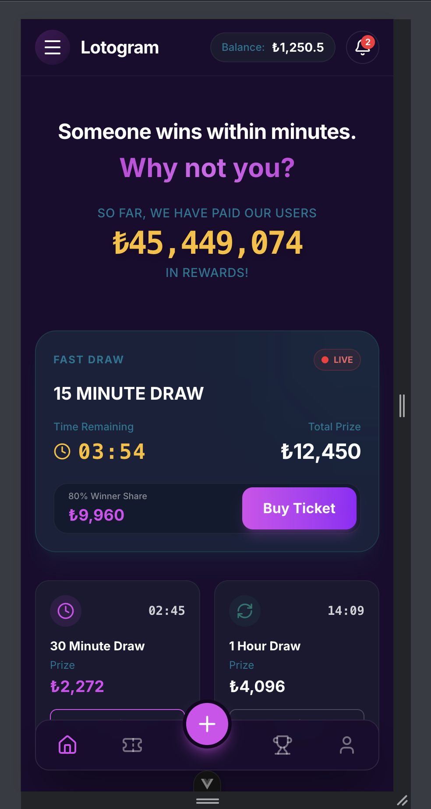
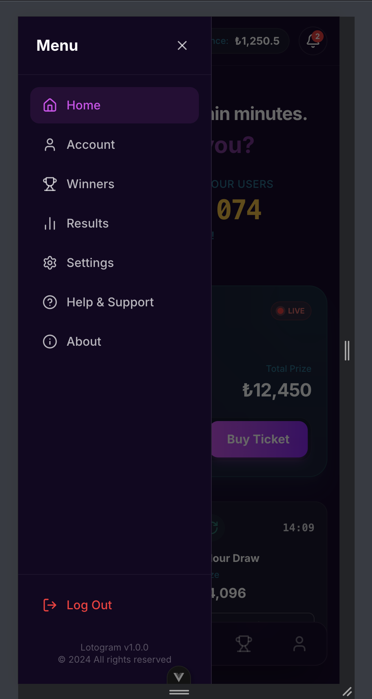
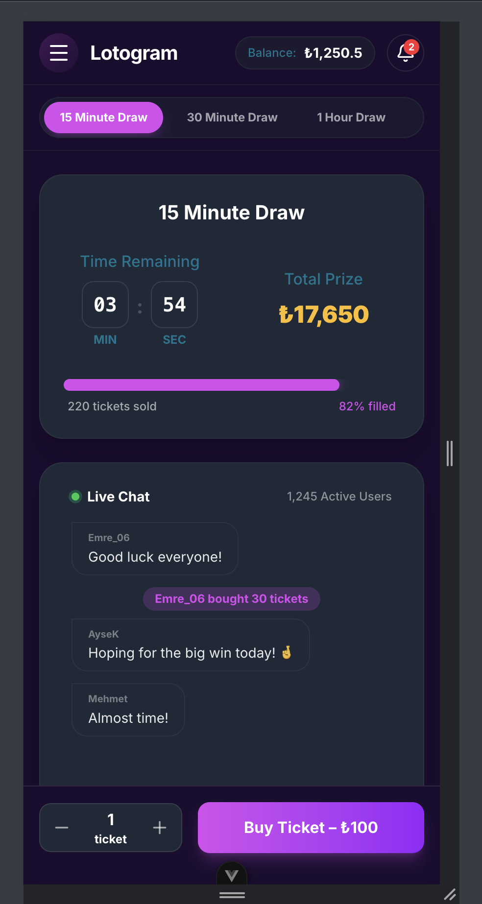
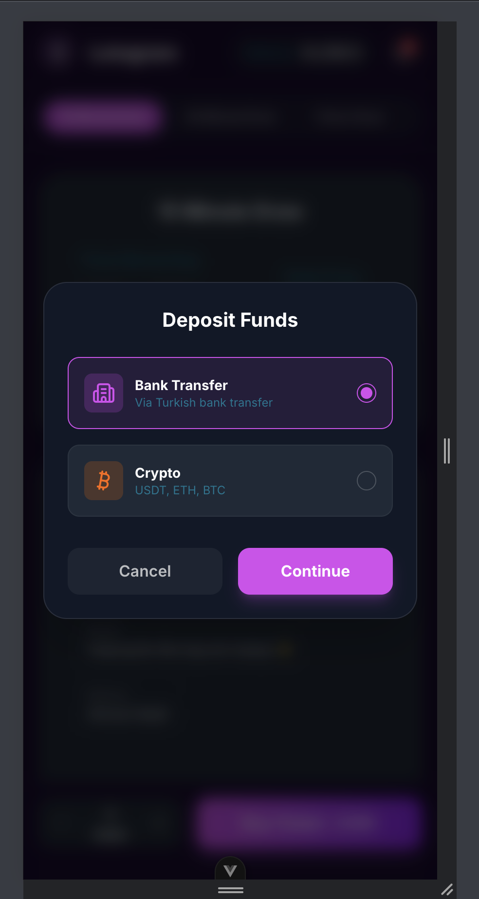

# Virgosoft Assessment Vue

A Vue.js application for the Virgosoft assessment.

## Getting Started

### Prerequisites

- Node.js (v20.19.0 or >=22.12.0)
- npm

### Installation

1. Clone the repository:

    ```sh
    git clone <repository-url>
    ```

2. Navigate to the project directory:

    ```sh
    cd virgosoft-assessment-vue
    ```

3. Install dependencies:

    ```sh
    npm install
    ```

### Running Locally

To start the development server:

```sh
npm run dev
```

The application will be available at `http://localhost:5173` (or the port shown in your terminal).

## Features & Screenshots

### Home Screen

The main landing page of the application, showing available draws and upcoming events.


### Side Menu

Navigation menu to access different sections of the application, such as Home, Tickets, and Transactions.


### Draw Details

Detailed view of a specific draw, allowing users to view prize information and select tickets.


### Deposit Funds

A dialog for users to add funds to their account to purchase tickets.


## Scripts

- `npm run dev`: Start development server
- `npm run build`: Build for production
- `npm run preview`: Preview production build
- `npm run test:unit`: Run unit tests
- `npm run lint`: Run linting
- `npm run format`: Format code with Prettier
